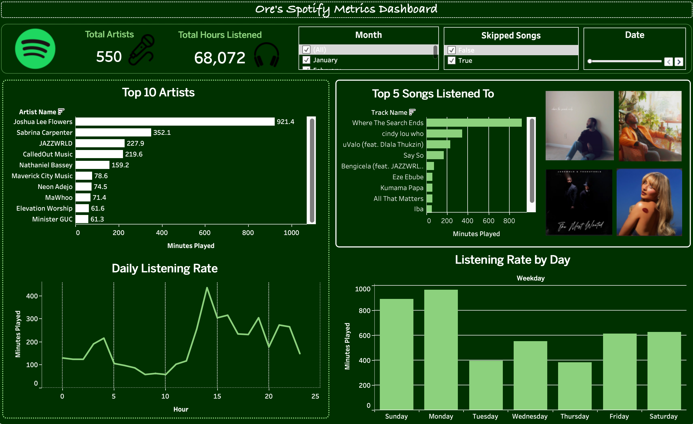

# 🎵 Ore's Spotify Listening Analysis

> *"Ever wondered what your music says about you? I dug into my Spotify streaming history using Python and Tableau to uncover my listening habits, guilty skips, and the artists I can't get enough of."*

Spoiler alert: I skip **a lot** of songs. Like, a concerning amount. But when I find something I love? I really, really love it. This project is a deep dive into 3 months of my Spotify listening history — from raw JSON data all the way to an interactive Tableau dashboard. Buckle up. 🎧

---

## 🖥️ The Dashboard

---

## 📁 Dataset Description

The dataset was requested directly from Spotify via their personal data export feature — no third-party tools, just me and my data. It covers every single song that played (or barely played 👀) between **November 2025 and February 2026**.

| Field | Description |
|-------|-------------|
| `endTime` | The exact moment a track stopped playing |
| `artistName` | The artist behind the music |
| `trackName` | The track that played (or got skipped 😬) |
| `msPlayed` | How long the track actually played, in milliseconds |

**By the numbers:**

| Stat | Value |
|------|-------|
| 🎼 Total plays | 4,524 |
| 🎤 Unique artists | 550 |
| 🎵 Unique tracks | 1,014 |
| ⏱️ Total listening time | 73.8 hours |
| ⏭️ Skipped plays | 3,345 (74%!) |

---

## 🛠️ Tools Used

| Tool | Purpose |
|------|---------|
| 🐍 **Python** (Google Colab) | Data loading, cleaning, and enrichment |
| 🐼 **pandas** | Data manipulation and transformation |
| 📊 **Tableau Desktop** | Interactive dashboard and visualisation |

---

## ⚙️ Analysis Process

**Step 1 — Loading the data 📂**

Spotify exports your data as a JSON file. The first job was reading it into a pandas DataFrame and getting familiar with what we were working with — 4 columns, 4,524 rows, and a whole lot of story.

**Step 2 — Cleaning and enriching 🧹**

Raw data is never ready for its close-up. Here's what got done:
- Converted `endTime` from a plain string into a proper datetime format
- Extracted `hour`, `weekday`, `month`, and `date` as individual columns for time-based analysis
- Converted `msPlayed` from milliseconds into `minutesPlayed` — because nobody thinks in milliseconds
- Added an `isSkip` flag for any play under 30 seconds (this column told some truths 😅)

**Step 3 — Export 📤**

The cleaned DataFrame was exported as a flat CSV file — one row per play, every enriched column included — and connected directly to Tableau Desktop.

**Step 4 — Visualisation 🎨**

Built a fully interactive dashboard in Tableau complete with filters for month, date, and skipped songs so you can slice and dice the data any way you like.

---

## 🔍 Findings

**👑 Joshua Lee Flowers is running the show**
With a whopping **921.4 minutes played** — more than double anyone else — Joshua Lee Flowers was the undisputed MVP of my listening history. Sabrina Carpenter came in second at 352.1 minutes, followed by JAZZWRLD, CalledOut Music, and Nathaniel Bassey. Gospel, R&B, indie, and pop all in the top 5. My playlist has range. 🎶

**🎵 "Where The Search Ends" had me in a chokehold**
It was the most played song by a significant margin. cindy lou who and uValo (feat. Dlala Thukzin) weren't far behind — a top 3 that jumps genres without a single apology.

**⏰ I'm a 3pm and 9pm listener**
The daily listening rate chart shows two very clear peaks — a mid-afternoon surge right around hour 15 and a strong evening session around hour 20-21. Early mornings? Silence. I am not a morning music person apparently.

**📅 Don't talk to me on Mondays without a playlist**
Monday is my biggest listening day by far, with Sunday as a close second. The week starts strong and tapers off — Thursday is the quietest day. Make of that what you will.

**⏭️ 74% of my plays are skips — yes, really**
Out of 4,524 plays, 3,345 were under 30 seconds. I browse more than I commit. But hey, at least I know what I like when I find it. 😅

---

## 📂 Files in this Repository

| File | Description |
|------|-------------|
| `spotify_analysis.ipynb` | Google Colab notebook with full Python analysis |
| `spotify_dashboard.twbx` | Packaged Tableau workbook with interactive dashboard |
| `dashboard.png` | Screenshot of the final Tableau dashboard |
| `README.md` | You're reading it! |

---

## 🚀 How to Use

1. Clone this repository
2. Open `spotify_analysis.ipynb` in Google Colab to explore the Python analysis
3. Open `spotify_dashboard.twbx` in Tableau Desktop or Tableau Public to interact with the dashboard

---

## 🎤 Want to do this with your own Spotify data?

Request your personal data export at [spotify.com/account](https://www.spotify.com/account) under **Privacy Settings → Download your data**. Fair warning — you might learn some uncomfortable truths about your skip rate. 😂

---

*From raw JSON to interactive dashboard — because data is just music waiting to be heard.* 🎵
